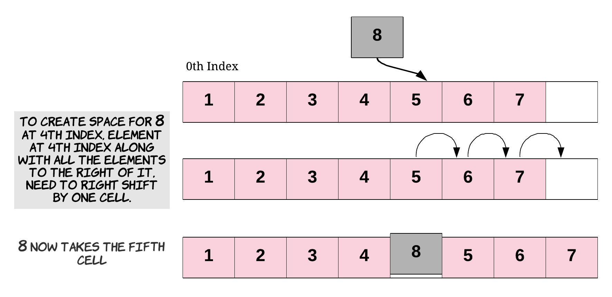
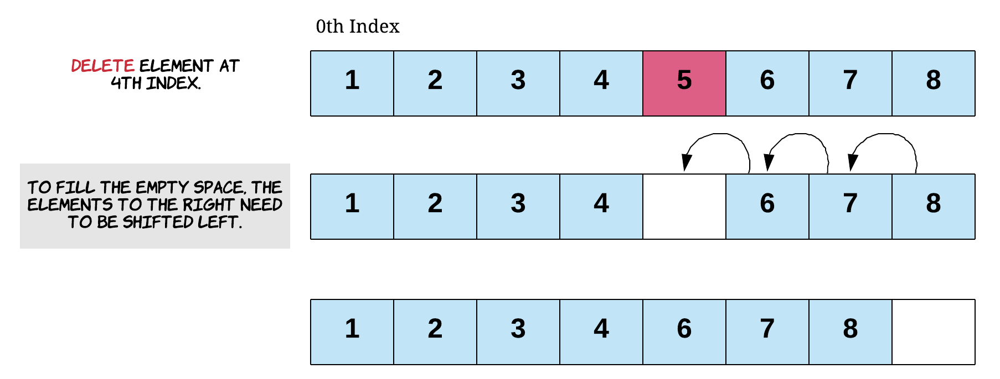
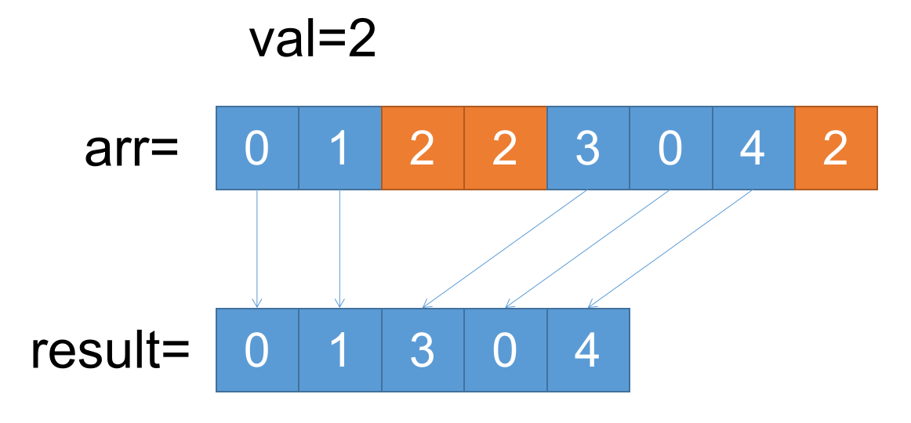
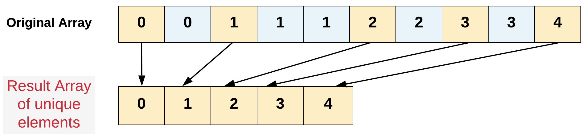
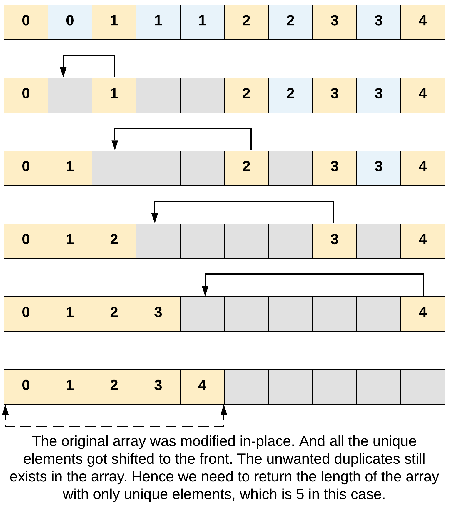
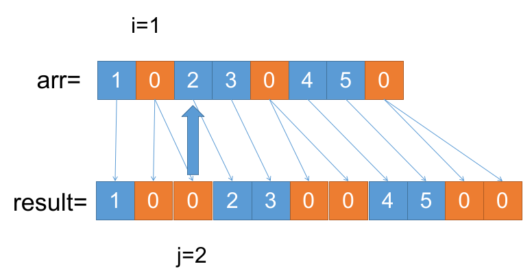
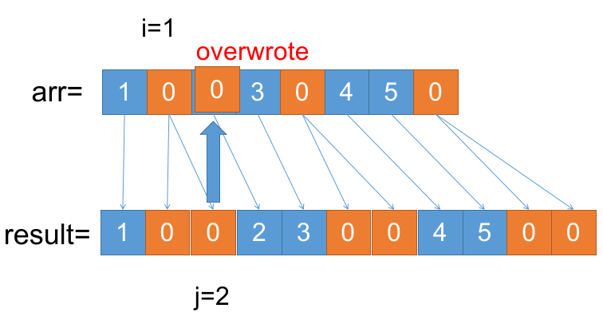
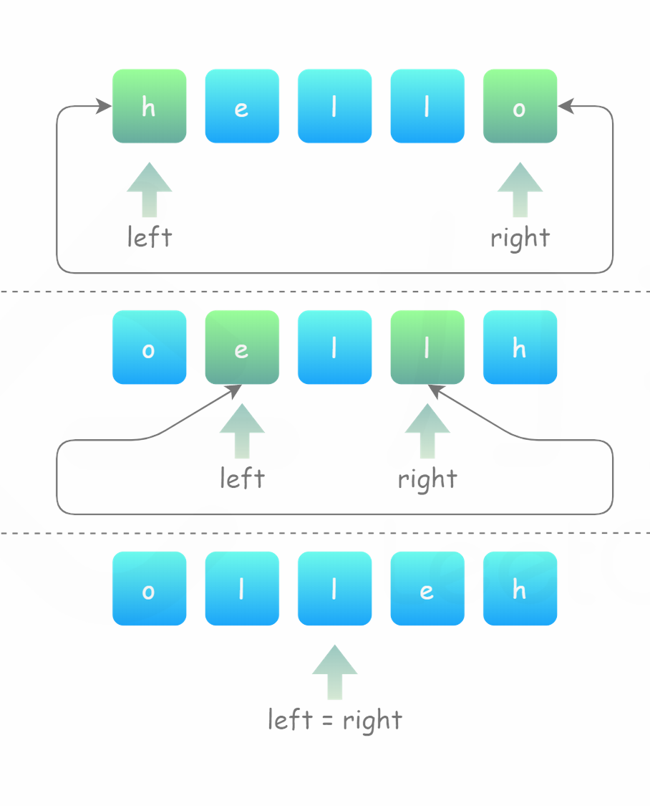

# Array Operations and "Two-Pointer" Technique

An **array** (`list` in Python) is a data structure stores a collection of elements in a contiguous memory location. **Appending** or **Deleting** element from the end of an array is a simple operation which takes approximately constant time ($O(1)$, `list.append(x)` and `list.pop()` in Python). However, **Inserting** or **Deleting** an element from the middle of an array is a complex operation which takes linear time ($O(n)$, `list.insert(i, x)` and `list.pop(i)` in Python).

**Some Notes:**

1. Some of the problem titles are linked to the original online problems. You can submit your solution there to check if it's correct.
2. To view the visualizations, you need to first download the raw HTML file, and then open it using a web browser.

## Insert into Array

To **Insert** a value into an array at any given index, we first need to shift all the elements from that index onwards one position to the right. Once the space is created for the new element, we proceed with the insertion. The shifting operation takes $O(n)$ time complexity.


[Image Source](https://leetcode.com/explore/learn/card/fun-with-arrays/525/inserting-items-into-an-array/3244/)

**Example 1:**

```
Input: arr = [0, 1, 2, 3, 4], idx = 2, val = 10
Output: [0, 1, 10, 2, 3, 4]
```

**Example 2:**

```
Input: arr = [1, 2, 3, 4, 5, 6, 7], idx = 4, val = 8
Output: [1, 2, 3, 4, 8, 5, 6, 7]
```

**Template:**

```python
def insert_into_array(arr: list[int], idx: int, val: int) -> None:
    """
    Modify `arr` inplace to insert `val` at index `idx`
    Please DO NOT use `arr.insert(idx, val)` in your implementation.
    """
    arr.append(0)  # Start with creating an new empty space at the end of the array
    # Please complete the implementation here


# Example:
arr = [0, 1, 2, 3, 4]
insert_into_array(arr, idx=2, val=10)
print(arr)  # [0, 1, 10, 2, 3, 4]

# vvv Testing vvv
from random import randint

for _ in range(10):
    arr = [randint(0, 10) for _ in range(10)]
    idx = randint(0, len(arr) - 1)
    val = randint(0, 10)
    result = arr.copy()
    insert_into_array(result, idx, val)
    real_result = arr.copy()
    real_result.insert(idx, val)
    if result != real_result:
        print(f"Failed, {arr=}, {idx=}, {val=}, {result=}, {real_result=}")
        quit()
print("Accepted")
```

[solution](solutions/Insert-into-Array.md)

## Delete from Array

To delete an element at given index, the empty space created by the deleted item will need to be filled. Each of the elements to the right of the index we're deleting at will get shifted to the left by one. The shifting operation takes $O(n)$ time complexity.


[Image Source](https://leetcode.com/explore/learn/card/fun-with-arrays/526/deleting-items-from-an-array/3246/)

**Example 1:**

```
Input: arr = [0, 11, 22, 33, 44], idx = 2
Output: [0, 11, 33, 44]
```

**Example 2:**

```
Input: arr = [1, 2, 3, 4, 5, 6, 7, 8], idx = 4
Output: [1, 2, 3, 4, 6, 7, 8]
```

**Template:**

```python
def delete_from_array(arr: list[int], idx: int) -> None:
    """
    Modify `arr` to delete the element at index `idx`
    Please DO NOT use `arr.pop(idx)` in your implementation.
    """
    # Please complete the implementation here

    arr.pop()  # End the function with popping the last element


# Example:
arr = [0, 11, 22, 33, 44]
delete_from_array(arr, 2)
print(arr)  # [0, 11, 33, 44]

arr = [1, 2, 3, 4, 5, 6, 7, 8]
delete_from_array(arr, 4)
print(arr)  # [1, 2, 3, 4, 6, 7, 8]

# vvv Testing vvv
from random import randint

for _ in range(10):
    arr = [randint(0, 10) for _ in range(10)]
    idx = randint(0, len(arr) - 1)
    result = arr.copy()
    delete_from_array(result, idx)
    real_result = arr.copy()
    real_result.pop(idx)
    if result != real_result:
        print(f"Failed: {arr=}, {idx=}, {result=}, {real_result=}")
        quit()
print("Accepted")
```

[solution](solutions/Delete-from-Array.md)

## [Remove Element](https://leetcode.com/problems/remove-element/)

Given an integer array `nums` and an integer `val`, remove all occurrences of `val` in `nums` [in-place](https://en.wikipedia.org/wiki/In-place_algorithm). The order of the elements may be changed. Then return *the number of elements in *`nums`* which are not equal to *`val`.

Consider the number of elements in `nums` which are not equal to `val` be `k`, to get accepted, you need to do the following things:

-   Change the array `nums` such that the first `k` elements of `nums` contain the elements which are not equal to `val`. The remaining elements of `nums` are not important as well as the size of `nums`.
-   Return `k`.

Note that repetitively calling the `delete_from_array` function we discussed earlier will result in a time complexity of $O(n^2)$ (consider an array of size $10^5$ with all elements equal to `val`, using the `delete_from_array` operation repetitively will need $(1+2+\dots+10^5)$ shifts), which is not acceptable. We need to solve this problem in $O(n)$ time complexity.

**Example 1:**

```
Input: nums = [3,2,2,3], val = 3
Output: 2, nums = [2,2,_,_]
Explanation: Your function should return k = 2, with the first two elements of nums being 2.
It does not matter what you leave beyond the returned k (hence they are underscores).
```

**Example 2:**

```
Input: nums = [0,1,2,2,3,0,4,2], val = 2
Output: 5, nums = [0,1,4,0,3,_,_,_]
Explanation: Your function should return k = 5, with the first five elements of nums containing 0, 0, 1, 3, and 4.
Note that the five elements can be returned in any order.
It does not matter what you leave beyond the returned k (hence they are underscores).
```

**Template:**

```python
from typing import List


class Solution:
    def removeElement(self, nums: List[int], val: int) -> int:
        """
        Modify `nums` inplace to remove all instances of `val`
        Return the length of the new array
        You don't need to pop the elements from the end of the array yourself
        If you want to submit the solution, please paste only this function to the leetcode editor
        """
        # Write your solution here


# Example:
s = Solution()

nums = [3, 2, 2, 3]
val = 3
k = s.removeElement(nums, val)
print(k)  # 2
print(nums[:k])  # [2, 2]

nums = [0, 1, 2, 2, 3, 0, 4, 2]
val = 2
k = s.removeElement(nums, val)
print(k)  # 5
print(nums[:k])  # [0, 1, 3, 0, 4]
```

**Hint:**

What would you do if you were **not** asked to perform the operation **in-place**?

```python
def removeElement(nums: List[int], val: int) -> List[int]:
    result = []
    for i in range(len(nums)):
        if nums[i] != val:
            result.append(nums[i])  # Which index should we put nums[i]?
    return result
```



Note that at each iteration, we are putting the `nums[i]` to the end of the `result`, whose index is `len(result)`, which increases by `1` at each insertion.

Instead of using an additional array to store the result, we can use a technique called "**two-pointer**". We can use a "pointer" variable `j` to keep track of the index where the next `nums[i]` should be placed, and iterate over the array with another "pointer" variable `i`.

We start with `j = 0`, and for each `i` from `0` to `len(nums)-1`, if `nums[i]` is not equal to `val`, we put it at `nums[j]` and increment `j` by `1`.

Note that at each step, `i += 1`, and `j += 0 or 1`. `j` will never be greater than `1`, so we do not need to worry about overwriting the elements we haven't processed yet.

You can first watch the visualization below to understand the concept better, and then try to implement the solution.

[visualization](visualizations/Remove-Element.html)
[solution](solutions/Remove-Element.md)

## [Remove Duplicates from Sorted Array](https://leetcode.com/problems/remove-duplicates-from-sorted-array/)

Given an integer array `nums` sorted in non-decreasing order, remove the duplicates [in-place](https://en.wikipedia.org/wiki/In-place_algorithm) such that each unique element appears only once. The relative order of the elements should be kept the same. Then return *the number of unique elements in *`nums`.

Consider the number of unique elements of `nums` to be `k`, to get accepted, you need to do the following things:

-   Change the array `nums` such that the first `k` elements of `nums` contain the unique elements in the order they were present in `nums` initially. The remaining elements of `nums` are not important as well as the size of `nums`.
-   Return `k`.

**Example 1:**

```
Input: nums = [1,1,2]
Output: 2, nums = [1,2,_]
Explanation: Your function should return k = 2, with the first two elements of nums being 1 and 2 respectively.
It does not matter what you leave beyond the returned k (hence they are underscores).
```

**Example 2:**

```
Input: nums = [0,0,1,1,1,2,2,3,3,4]
Output: 5, nums = [0,1,2,3,4,_,_,_,_,_]
Explanation: Your function should return k = 5, with the first five elements of nums being 0, 1, 2, 3, and 4 respectively.
It does not matter what you leave beyond the returned k (hence they are underscores).
```

**Template:**

```python
from typing import List


class Solution:
    def removeDuplicates(self, nums: List[int]) -> int:
        # Write your solution here


# Example:
s = Solution()

nums = [1, 1, 2]
k = s.removeDuplicates(nums)
print(k)  # 2
print(nums[:k])  # [1, 2]

nums = [0, 0, 1, 1, 1, 2, 2, 3, 3, 4]
k = s.removeDuplicates(nums)
print(k)  # 5
print(nums[:k])  # [0, 1, 2, 3, 4]
```

**Hint:**


[Image Source](https://leetcode.com/explore/learn/card/fun-with-arrays/511/in-place-operations/3256/)

If `nums[i] == nums[i-1]`, we delete `nums[i]`.

The rest part is exactly the same as the previous problem.


[Image Source](https://leetcode.com/explore/learn/card/fun-with-arrays/511/in-place-operations/3255/)

You can first watch the visualization below to understand the concept better, and then try to implement the solution.

[visualization](visualizations/Remove-Duplicates-from-Sorted-Array.html)
[solution](solutions/Remove-Duplicates-from-Sorted-Array.md)

## [Sort Array By Parity](https://leetcode.com/problems/sort-array-by-parity/)

Given an integer array `nums`, move all the even integers at the beginning of the array followed by all the odd integers.

Return *any array that satisfies this condition*.

**Example 1:**

```
Input: nums = [3,1,2,4]
Output: [2,4,3,1]
Explanation: The outputs [4,2,3,1], [2,4,1,3], and [4,2,1,3] would also be accepted.
```

**Example 2:**

```
Input: nums = [0]
Output: [0]
```

**Constraints:**

-   `1 <= nums.length <= 5000`
-   `0 <= nums[i] <= 5000`

**Note:**

-   $x$ is even if and only if `x % 2 == 0`.
-   $x$ is odd if and only if `x % 2 == 1`.

**Template:**

```python
from typing import List

class Solution:
    def sortArrayByParity(self, nums: List[int]) -> List[int]:
        # Write your solution here


# Example:
s = Solution()

nums = [3, 1, 2, 4]
print(s.sortArrayByParity(nums))  # [2, 4, 3, 1]

nums = [0]
print(s.sortArrayByParity(nums))  # [0]
```

**Hint:**

You can also use the **two-pointer** technique in this problem. You can have a "pointer" `j` to keep track of the index where the next even number should be placed, and iterate over the array with another "pointer" `i`.

Once you find an even number at `nums[i]`, you can swap `nums[i]` with `nums[j]` and increment `j`.

You can first watch the visualization below to understand the concept better, and then try to implement the solution.

[visualization](visualizations/Sort-Array-By-Parity.html)
[solution](solutions/Sort-Array-By-Parity.md)

## [Duplicate Zeros](https://leetcode.com/problems/duplicate-zeros/)

Given a fixed-length integer array `arr`, duplicate each occurrence of zero, shifting the remaining elements to the right.

Note that elements beyond the length of the original array are **not written**. Do the above modifications to the input array **in-place** and do not return anything.

We need to solve the problem in $O(n)$ time complexity.

**Example 1:**

```
Input: arr = [1,0,2,3,0,4,5,0]
Output: [1,0,0,2,3,0,0,4]
Explanation: After calling your function, the input array is modified to: [1,0,0,2,3,0,0,4]
```

**Example 2:**

```
Input: arr = [1,2,3]
Output: [1,2,3]
Explanation: After calling your function, the input array is modified to: [1,2,3]
```

**Template:**

```python
from typing import List


class Solution:
    def duplicateZeros(self, arr: List[int]) -> None:
        """
        Do not return anything, modify arr in-place instead.
        """
        # Write your solution here


# Example:
s = Solution()

arr = [1, 0, 2, 3, 0, 4, 5, 0]
s.duplicateZeros(arr)
print(arr)  # [1, 0, 0, 2, 3, 0, 0, 4]

arr = [1, 2, 3]
s.duplicateZeros(arr)
print(arr)  # [1, 2, 3]
```

**Hint:**

Again, what would you do if you were **not** asked to perform the operation **in-place**?

```python
def duplicateZeros(arr: List[int]) -> List[int]:
    result = []
    for i in range(len(arr)):
        result.append(arr[i])
        if arr[i] == 0:
            result.append(0)
    return result[:len(arr)]
```

Can we use the "**two-pointer**" technique again? Not directly! In the previous problems, the "pointer" `j` was always behind the "pointer" `i` we are iterating over, thus we can modify `arr[j]` without worrying about overwriting the elements we haven't processed yet. However, in this problem, we need to insert additional `0`s to the array, causing the pointer `j` to be advanced by `2` steps instead of `1` step, and overwriting the elements we haven't iterated over with the pointer `i`.




How do we solve this problem? We can iterate over the array in reversed order, where `i` starts with `len(arr) - 1` and `j` starts with `len(arr) + arr.count(0) -1`. In each step, `i -= 1`, and `j -= 1 or 2`. `j` will never be less than `i`, avoiding overwriting the elements we haven't processed yet.

You can first watch the visualization below to understand the concept better, and then try to implement the solution.

[visualization](visualizations/Duplicate-Zeros.html)
[solution](solutions/Duplicate-Zeros.md)

## [Reversing an Array](https://leetcode.com/problems/Reverse-String)

Write a function that reverses an array. The input array is given as an array of characters `s`.

You must do this by modifying the input array [in-place](https://en.wikipedia.org/wiki/In-place_algorithm) with `O(1)` extra memory.

**Example 1:**

```
Input: s = ["h","e","l","l","o"]
Output: ["o","l","l","e","h"]
```

**Example 2:**

```
Input: s = ["H","a","n","n","a","h"]
Output: ["h","a","n","n","a","H"]
```

**Template:**

```python
from typing import List

class Solution:
    def reverseString(self, s: List[str]) -> None:
        """
        Do not return anything, modify s in-place instead.
        """


# Example:
s = Solution()

s1 = ["h", "e", "l", "l", "o"]
s.reverseString(s1)
print(s1)  # ["o", "l", "l", "e", "h"]

s2 = ["H", "a", "n", "n", "a", "h"]
s.reverseString(s2)
print(s2)  # ["h", "a", "n", "n", "a", "H"]
```

**Hint:**

This time, instead of having the 2 pointers moving in the same direction, we can have them moving towards each other, starting from both ends of the array. We use `l` and `r` to represent the left and right pointers.

```python
def reverseString(arr: list) -> None:
    l, r = 0, len(s) - 1
    while l < r:
        ...  # deal with arr[l] and arr[r] here
        l += 1
        r -= 1
```


[Image Source](https://leetcode.cn/problems/reverse-string/solutions/439034/fan-zhuan-zi-fu-chuan-by-leetcode-solution)

[solution](solutions/Reversing-an-Array.md)

## Check if a String is Palindrome

A **palindrome** is a string that reads the same backward as forward. Given a string `s`, return `True` if `s` is a palindrome, and `False` otherwise.

**Example 1:**

```
Input: s = "racecar"
Output: True
Explanation: "racecar" == "racecar"
```

**Example 2:**

```
Input: s = "hello"
Output: False
Explanation: "hello" != "olleh"
```

**Example 3:**

```
Input: s = "wow"
Output: True
```

**Example 4:**

```
Input: s = "cabbac"
Output: True
```

**Example 5:**

```
Input: s = "abcb"
Output: False
```

**Template:**

```python
def is_palindrome(s: str) -> bool:
    # Write your solution here


# Examples
print(is_palindrome("racecar"))  # True
print(is_palindrome("hello"))  # False
print(is_palindrome("wow"))  # True
print(is_palindrome("cabbac"))  # True
print(is_palindrome("abcb"))  # False
# vvv Meme vvv
print(is_palindrome("(()())"))  # False
print(is_palindrome("(())(("))  # True


# vvv Testing vvv
from random import randint
def rand_char() -> str:
    return chr(randint(ord("a"), ord("z")))
def is_palindrome_ans(s: str) -> bool:
    return s == s[::-1]
for _ in range(10):
    s = "".join(rand_char() for _ in range(10))
    if randint(0, 1):
        s += s[::-1] if randint(0, 1) else rand_char() + s[::-1]
    if is_palindrome(s) != is_palindrome_ans(s):
        print("Wrong Answer")
        print(f"{s=}")
        print(f"answer: {is_palindrome_ans(s)}")
        print(f"your answer: {is_palindrome(s)}")
        quit()
print("Accepted")
```

[solution](solutions/Check-if-a-String-is-Palindrome.md)

**Template:**

**Hint:**

To check if a given string `s` is a palindrome, we need to use 2 pointers `l` and `r`, starting from both ends of the string, just like the previous problem.

We need to compare `s[l]` and `s[r]` in each iteration. If they are not equal, we can return `False` immediately.

If the pointers meet in the middle of the string, meaning that we have checked all the characters, we can return `True`.

[solution](solutions/Check-if-a-String-is-Palindrome.md)

## [Minimum Size Subarray Sum](https://leetcode.com/problems/minimum-size-subarray-sum/)

Given an array of positive integers `nums` and a positive integer `target`, return *the minimal length of a **subarray** whose sum is greater than or equal to* `target`. If there is no such subarray, return `0` instead.

We need to solve the problem in $O(n)$ time complexity.

**Example 1:**

```
Input: target = 7, nums = [2,3,1,2,4,3]
Output: 2
Explanation: The subarray [4,3] has the minimal length under the problem constraint.
```

**Example 2:**

```
Input: target = 4, nums = [1,4,4]
Output: 1
```

**Example 3:**

```
Input: target = 11, nums = [1,1,1,1,1,1,1,1]
Output: 0
```

**Constraints:**

-   $1 \le target \le 10^9$
-   $1 \le nums.length \le 10^5$
-   $1 \le nums[i] \le 10^4$

**Template:**

```python
from typing import List

class Solution:
    def minSubArrayLen(self, target: int, nums: List[int]) -> int:
        # Write your solution here


# Example:
s = Solution()

target = 7
nums = [2, 3, 1, 2, 4, 3]
print(s.minSubArrayLen(target, nums))  # 2

target = 4
nums = [1, 4, 4]
print(s.minSubArrayLen(target, nums))  # 1

target = 11
nums = [1, 1, 1, 1, 1, 1, 1, 1]
print(s.minSubArrayLen(target, nums))  # 0
```

**Hint:**

In this problem, we define a **Variable Sized Sliding Window** using two pointers `l` and `r`. We need to keep the sum of the elements inside the window $\textbf{sum}(nums[l:r+1]) \ge target$. We can find the minimum size of all the windows that satisfy the condition.

How do we maintain the window? Typically, a **Variable Sized Sliding Window** problem can be solved using the following template:

```python
def sliding_window(nums: List[int]) -> int:
    acc = 0  # accumulator
    l = 0
    for r in range(len(nums)):  # advance the right boundary of the window
        acc += nums[r]          # update the accumulator using the new element on the right boundary
        while (acc - nums[l]) satisfies the condition:
            acc -= nums[l]  # undo the leftmost element of the window
            l += 1          # contract the left boundary of the window
        if acc satisfies the condition:
            nums[l:r+1] is a valid window
            # update the answer
```

In each iteration, we advance the right boundary of the window by `1`, and contract the left boundary of the window as much as possible, as if the window is "sliding" to the right.

You can first watch the visualization below to understand the concept better, and then try to implement the solution.

[visualization](visualizations/Minimum-Size-Subarray-Sum.html)
[solution](solutions/Minimum-Size-Subarray-Sum.md)

# Homework

## [Merge Sorted Array](https://leetcode.com/problems/Merge-Sorted-Array/)

You are given two integer arrays `nums1` and `nums2`, sorted in non-decreasing order, and two integers `m` and `n`, representing the number of elements in `nums1` and `nums2` respectively.

Merge `nums1` and `nums2` into a single array sorted in non-decreasing order.

The final sorted array should not be returned by the function, but instead be *stored inside the array *`nums1`. To accommodate this, `nums1` has a length of `m + n`, where the first `m` elements denote the elements that should be merged, and the last `n` elements are set to `0` and should be ignored. `nums2` has a length of `n`.

**Example 1:**

```
Input: nums1 = [1,2,3,0,0,0], m = 3, nums2 = [2,5,6], n = 3
Output: [1,2,2,3,5,6]
Explanation: The arrays we are merging are [1,2,3] and [2,5,6].
The result of the merge is [1,2,2,3,5,6] with the underlined elements coming from nums1.
```

**Example 2:**

```
Input: nums1 = [1], m = 1, nums2 = [], n = 0
Output: [1]
Explanation: The arrays we are merging are [1] and [].
The result of the merge is [1].
```

**Example 3:**

```
Input: nums1 = [0], m = 0, nums2 = [1], n = 1
Output: [1]
Explanation: The arrays we are merging are [] and [1].
The result of the merge is [1].
Note that because m = 0, there are no elements in nums1. The 0 is only there to ensure the merge result can fit in nums1.
```

**Template:**

```python
from typing import List


class Solution:
    def merge(self, nums1: List[int], m: int, nums2: List[int], n: int) -> None:
        """
        Do not return anything, modify nums1 in-place instead.
        """
        # Write your solution here


# Example:
s = Solution()

nums1 = [1, 2, 3, 0, 0, 0]
m = 3
nums2 = [2, 5, 6]
n = 3
s.merge(nums1, m, nums2, n)
print(nums1)  # [1, 2, 2, 3, 5, 6]

nums1 = [1]
m = 1
nums2 = []
n = 0
s.merge(nums1, m, nums2, n)
print(nums1)  # [1]

nums1 = [0]
m = 0
nums2 = [1]
n = 1
s.merge(nums1, m, nums2, n)
print(nums1)  # [1]
```

**Hint:**

First try to solve the problem without the **in-place** requirement. The **two-pointer** technique is needed even without the **in-place** requirement.


[Image Source](https://leetcode.cn/problems/merge-sorted-array/solutions/666608/he-bing-liang-ge-you-xu-shu-zu-by-leetco-rrb0)

```python
def merge(nums1: list[int], m: int, nums2: list[int], n: int) -> list[int]:
    result = []
    j = 0
    for i in range(m):
        while j < n and ...:  # What should be the condition, such that we can append nums2[j] instead of nums1[i]?
            result.append(nums2[j])
            j += 1
        result.append(nums1[i])
    while j < n:  # Why is this necessary?
        result.append(nums2[j])
        j += 1
    return result


# Example:
nums1 = [1, 2, 3, 0, 0, 0]
m = 3
nums2 = [2, 5, 6]
n = 3
print(merge(nums1, m, nums2, n))  # [1, 2, 2, 3, 5, 6]

nums1 = [1]
m = 1
nums2 = []
n = 0
print(merge(nums1, m, nums2, n))  # [1]

nums1 = [0]
m = 0
nums2 = [1]
n = 1
print(merge(nums1, m, nums2, n))  # [1]
```

Then, use the **reversed two-pointer** technique to make **in-place** possible.

[solution](solutions/Merge-Sorted-Array.md)

## [Max Consecutive Ones III](https://leetcode.com/problems/max-consecutive-ones-iii/)

Given a binary array `nums` and an integer `k`, return *the maximum number of consecutive *`1`*'s in the array if you can flip at most* `k` `0`'s.

We need to solve the problem in $O(n)$ time complexity.

**Example 1:**

```
Input: nums = [1,1,1,0,0,0,1,1,1,1,0], k = 2
Output: 6
Explanation:  [1,1,1,0,0,1,1,1,1,1,1]
                         ^---------^
```

**Example 2:**

```
Input: nums = [0,0,1,1,0,0,1,1,1,0,1,1,0,0,0,1,1,1,1], k = 3
Output: 10
Explanation:  [0,0,1,1,1,1,1,1,1,1,1,1,0,0,0,1,1,1,1]
                   ----^-^-------^----
```

**Constraints:**

-   $1 \le nums.length \le 10^5$
-   $nums[i]$ is either `0` or `1`.
-   $0 \le k \le nums.length$

**Template:**

```python
from typing import List

class Solution:
    def longestOnes(self, nums: List[int], k: int) -> int:
        # Write your solution here


# Example:
s = Solution()

nums = [1, 1, 1, 0, 0, 0, 1, 1, 1, 1, 0]
k = 2
print(s.longestOnes(nums, k))  # 6

nums = [0, 0, 1, 1, 0, 0, 1, 1, 1, 0, 1, 1, 0, 0, 0, 1, 1, 1, 1]
k = 3
print(s.longestOnes(nums, k))  # 10
```

**Hint:**

Use the **Variable Sized Sliding Window** technique, maintaining the window to have at most `k` zeros. Find the maximum window size that satisfies the condition.

[visualization](visualizations/Max-Consecutive-Ones-III.html)
[solution](solutions/Max-Consecutive-Ones-III.md)
