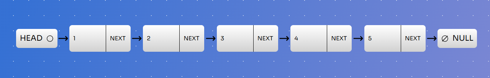
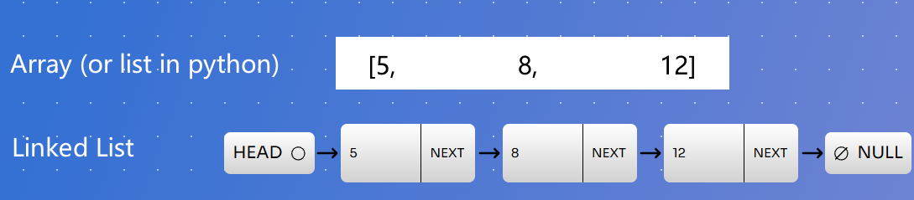
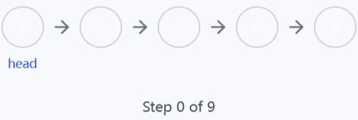

# Announcements

1. The AIPO preliminary problems have been released and solutions must be submitted before early Feb.
2. CSIT will hold an open day on our undergraduate programmes next Wednesday 15th January from 3-5pm.

> Please go to <https://github.com/MPT-ADVANCED-2024/Class-Material/tree/master/week8> to access the slides and code snippets.

---

# Introduction to Linked Lists

- A data structure that stores a sequence of data using nodes
- Each node contains:
  - Data
  - Pointer to the next node
- Last node points to `None`/`null`



<https://linked-list-visualizer.vercel.app/app>

---

# Key Characteristics

- Dynamic size with Non-contiguous memory allocation, where arrays are contiguous
- random access to elements at index $i$ takes $O(n)$ time, where arrays have $O(1)$
- Efficient ($O(1)$) insertion and deletion of any element, where arrays have $O(n)$

<style scoped>section { font-size: 28px; }</style>

> Note that while `list` in Python provide $O(1)$ `append` and `pop` operations at the end of the array, when the size exceeds the allocated memory, it actually reallocates memory and copies the entire list, which is more complicated than a linked list.
> <https://docs.python.org/3/faq/design.html#how-are-lists-implemented-in-cpython>

---

# Memory Comparison: Arrays vs Linked Lists

## Arrays (Python Lists)
```python
# Stored in contiguous memory
numbers = [5, 12, 8]
```

## Linked Lists
```python
# Nodes can be scattered in memory
node1 = ListNode(5)
node2 = ListNode(12)
node3 = ListNode(8)
# The links
node1.next = node2
node2.next = node3
node3.next = None
```

---

# Memory Comparison: Arrays vs Linked Lists



---

# Basic ListNode Structure in Python

```python
class ListNode:
    def __init__(self, val=None, next=None):
        self.val = val    # Store the actual data/value
        self.next = next  # Reference to next node
```

Or with type annotations:

```python
from typing import Optional

class ListNode:
    def __init__(self, val: Optional[int] = None, next: Optional["ListNode"] = None) -> None:
        self.val = val
        self.next = next
```

> type annotations in Python are optional, but they can help code editors like VSCode provide better code suggestions.

---

# Traversing a Linked List

```python
class ListNode:
    def __init__(self, val=None, next=None):
        self.val = val    # Store the actual data/value
        self.next = next  # Reference to next node
```

```python
def print_linked_list(first_node: Optional[ListNode]) -> None:
    cur = first_node  # a pointer to the "cur"rent node
    while cur is not None:
        print(cur.val, end="->" if cur.next is not None else "\n")
        cur = cur.next  # move to the next node
```

```python
a, b, c = ListNode(5), ListNode(12), ListNode(8)
a.next = b
b.next = c
print_linked_list(a)  # 5->12->8
```

---

Or you can use recursion from the last class:

```python
def print_linked_list(cur: Optional[ListNode]) -> None:
    if cur is None:
        return
    print(cur.val, end="->" if cur.next is not None else "\n")
    print_linked_list(cur.next)
```

---

# Exercise: Convert a Linked List to a Python List

```python
def to_list(first_node: Optional[ListNode]) -> list[int]:
    result = []
    cur = first_node
    while ...:  # traverse the linked list
        ...  # append the value of the current node to the result list
    return result


a, b, c = ListNode(5), ListNode(12), ListNode(8)
a.next = b
b.next = c
print(to_list(a))  # [5, 12, 8]
```

---

# Solution

```python
def to_list(first_node: Optional[ListNode]) -> list[int]:
    result = []
    cur = first_node
    while cur is not None:
        result.append(cur.val)
        cur = cur.next
    return result
```

---

# Exercise: Convert a Python List to a Linked List

```python
def to_linked_list(arr: list[int]) -> Optional[ListNode]:
    if not arr:  # if the input list is empty
        return None
    first_node = ListNode(arr[0])
    cur = first_node
    for val in arr[1:]:
        """
        1. create a new node with the value `val`
        2. set the next node of the current node to the new node
        3. move the current node to the new node
        """
        ...
    return first_node

arr = [5, 12, 8, 5, 8]
first_node = to_linked_list(arr)
print_linked_list(first_node)  # 5->12->8->5->8
```

---

# Solution

```python
def to_linked_list(arr: list[int]) -> Optional[ListNode]:
    if not arr:  # if the input list is empty
        return None
    first_node = ListNode(arr[0])
    cur = first_node
    for val in arr[1:]:
        cur.next = ListNode(val)
        cur = cur.next
    return first_node
```

---

You could also pre-create all the nodes in a list first and then link them:

```python
def to_linked_list(arr: list[int]) -> Optional[ListNode]:
    nodes = [ListNode(val) for val in arr]
    for i in range(1, len(nodes)):
        nodes[i - 1].next = nodes[i]
    return nodes[0] if nodes else None
```

But this approach would be considered "**cheating**" (for today only) because it exploits the random access property of arrays, which linked lists do not have.

---

# Exercise: replace all occurrences of a val to a new val

```python
def replace_all(first_node: Optional[ListNode], old_val: int, new_val: int) -> None:
    cur = first_node
    while ...:  # traverse the linked list
        if ...:  # apply change if needed
            ...
        ...


first_node = to_linked_list([5, 12, 8, 5, 8])
replace_all(first_node, 5, 10)
print_linked_list(first_node)  # 10->12->8->10->8
```

---

# Solution

```python
def replace_all(first_node: Optional[ListNode], old_val: int, new_val: int) -> None:
    cur = first_node
    while cur is not None:
        if cur.val == old_val:
            cur.val = new_val
        cur = cur.next
```

---

# Exercise: Access the i-th element

```python
def get_at_index(first_node: Optional[ListNode], i: int) -> Optional[int]:
    cur = first_node
    for _ in range(i):
        ... # go to the i-th node, return None if you cannot reach it
    return cur.val if cur is not None else None

first_node = to_linked_list([5, 12, 8, 5, 8])
print(get_at_index(first_node, 2))  # 8
print(get_at_index(first_node, 3))  # 5
print(get_at_index(first_node, 100))  # None
```

---

# Solution

```python
def get_at_index(first_node: Optional[ListNode], i: int) -> Optional[int]:
    cur = first_node
    for _ in range(i):
        if cur is None: # if you cannot reach the next node
            return None
        cur = cur.next
    return cur.val if cur is not None else None
```

---

# Exercise: Insert a new node at the beginning

This time, we pass a dummy node we created before the first node to the function, which is the `before_first` node of the linked list.\
This is because when we insert or delete a node, we must hold a pointer to the previous node, and apply insert or delete by changing the `next` pointer of the previous node.

<style scoped>pre { font-size: 60%; }</style>

```python
def insert_at_beginning(before_first: ListNode, val: int) -> None:
    """
    1. create a new node with the value `val`,
       and the next node is the current first nod[e
    2. set the next node of the `before_first` node to the new node
    """
    ...

before_first = ListNode()
before_first.next = to_linked_list([5, 12, 8])
insert_at_beginning(before_first, 3)
print_linked_list(before_first.next)  # 3->5->12->8
```

---

# Solution

```python
def insert_at_beginning(before_first: ListNode, val: int) -> None:
    new_node = ListNode(val, before_first.next)
    before_first.next = new_node
```

---

# Exercise: Insert a new node at the end

```python
def insert_at_end(before_first: ListNode, val: int) -> None:
    cur = before_first
    while ...:  # go to the last node
        ...

before_first = ListNode()
before_first.next = to_linked_list([5, 12, 8])
insert_at_end(before_first, 3)
print_linked_list(before_first.next)  # 5->12->8->3
```

---

# Solution

```python
def insert_at_end(before_first: ListNode, val: int) -> None:
    cur = before_first
    while cur.next is not None:  # go to the last node
        cur = cur.next
    cur.next = ListNode(val)
```

---

# Exercise: Insert a new node at the i-th index

```python
def insert_at_index(before_first: ListNode, i: int, val: int) -> None:
    """
    if i == 0, it is the same as inserting at the beginning
    if i == the length of the linked list, it is the same as inserting at the end
    if i > the length of the linked list, do nothing
    """
    cur = before_first
    for _ in range(i):
        """
        go to the previous node of the i-th node
        return nothing if the previous node of the i-th node does not exist
        """
        ...
    ...  # perform the insertion

before_first = ListNode()
before_first.next = to_linked_list([5, 12, 8])
insert_at_index(before_first, 0, 3), print_linked_list(before_first.next)  # 3->5->12->8
insert_at_index(before_first, 2, 7), print_linked_list(before_first.next)  # 3->5->7->12->8
insert_at_index(before_first, 5, 10), print_linked_list(before_first.next)  # 3->5->7->12->8->10
insert_at_index(before_first, 100, 15), print_linked_list(before_first.next)  # 3->5->7->12->8->10
```

---

# Solution

```python
def insert_at_index(before_first: ListNode, i: int, val: int) -> None:
    cur = before_first
    for _ in range(i):
        if cur.next is None:
            return  # the previous node of the i-th node does not exist
        cur = cur.next
    new_node = ListNode(val, cur.next)
    cur.next = new_node
```

---

# Exercise: Delete the first node if it exists

```python
def delete_first(before_first: ListNode) -> None:
    if before_first.next is None:
        return
    # set the next node of the `before_first` node to the next node of the first node
    ...

before_first = ListNode()
before_first.next = to_linked_list([5, 12, 8])
delete_first(before_first)
print_linked_list(before_first.next)  # 12->8
```

---

# Solution

```python
def delete_first(before_first: ListNode) -> None:
    if before_first.next is None:
        return
    before_first.next = before_first.next.next
    # the previous first node is no longer being referenced
    # so it will be garbage collected (that is, deleted) by Python.
    # In other languages like C++, you may need to manually
    # free the memory using `delete previous_first_node;`
```

---

# Exercise: Delete the i-th node if it exists

```python
def delete_at_index(before_first: ListNode, i: int) -> None:
    cur = before_first
    for _ in range(i):
        """
        go to the previous node of the i-th node
        return nothing if the previous node of the i-th node does not exist
        """
        ...
    ... # delete the next node if it exists

before_first = ListNode()
before_first.next = to_linked_list([5, 12, 8])
delete_at_index(before_first, 1)
print_linked_list(before_first.next)  # 5->8
```

---

# Solution

```python
def delete_at_index(before_first: ListNode, i: int) -> None:
    cur = before_first
    for _ in range(i):
        if cur.next is None:
            return  # the previous node of the i-th node does not exist
        cur = cur.next
    if cur.next is not None:
        cur.next = cur.next.next
```

---

# Exercise: Design Linked List

<https://leetcode.com/problems/design-linked-list>

Combine the functions we have implemented so far into a single class `MyLinkedList`:

<style scoped>pre { font-size: 65%; }</style>

```python
from typing import Optional

class ListNode:
    def __init__(self, val: Optional[int] = None, next: Optional["ListNode"] = None) -> None:
        self.val = val
        self.next: Optional[ListNode] = next

class MyLinkedList:
    def __init__(self):
        self.before_begin = ListNode()

    def get(self, index: int) -> int: ...
    def addAtHead(self, val: int) -> None: ...
    def addAtTail(self, val: int) -> None: ...
    def addAtIndex(self, index: int, val: int) -> None: ...
    def deleteAtIndex(self, index: int) -> None: ...
```

---

```python
    def __str__(self) -> str:
        "for print to work"
        cur = self.before_begin
        result = []
        while cur.next is not None:
            cur = cur.next
            result.append(str(cur.val))
        return "->".join(result)

myLinkedList = MyLinkedList()
myLinkedList.addAtHead(1), print(myLinkedList)  # 1
myLinkedList.addAtTail(3), print(myLinkedList)  # 1->3
myLinkedList.addAtIndex(1, 2), print(myLinkedList)  # 1->2->3
print(myLinkedList.get(1))  # 2
myLinkedList.deleteAtIndex(1), print(myLinkedList)  # 1->3
print(myLinkedList.get(1))  # 3
```

Solution: <https://github.com/MPT-ADVANCED-2024/Class-Material/tree/master/week8/solutions/DesignLinkedList.py>

---

# Exercise: Remove Linked List Elements

<https://leetcode.com/problems/remove-linked-list-elements>

<style scoped>pre { font-size: 75%; }</style>

```python
class Solution:
    def removeElements(self, head: Optional[ListNode], val: int) -> Optional[ListNode]:
        before_head = ListNode()
        before_head.next = head

        prev = before_head
        while prev.next is not None:
            """
            1. if the next node has the value `val`, remove it
            2. otherwise, move the prev node to the next node
            """
            ...
        return before_head.next


head = to_linked_list([1, 2, 6, 3, 4, 5, 6])
head = Solution().removeElements(head, 6)
print_linked_list(head)  # 1->2->3->4->5
```

---

# Solution

```python
class Solution:
    def removeElements(self, head: Optional[ListNode], val: int) -> Optional[ListNode]:
        before_head = ListNode()
        before_head.next = head

        prev = before_head
        while prev.next is not None:
            if prev.next.val == val:
                prev.next = prev.next.next
            else:
                prev = prev.next

        return before_head.next
```

---

# Exercise: Reverse a Linked List

<https://leetcode.com/problems/reverse-linked-list>

<div class="columns">

```python
class Solution:
    def reverseList(self,
        head: Optional[ListNode],
    ) -> Optional[ListNode]:
        prev = None
        while head is not None:
            """
            1. prev->head => prev<-head
            2. move `prev` to the `head`
            3. move `head` to the next node
            """
            ...
        return prev

head = to_linked_list([1, 2, 3, 4, 5])
rev = Solution().reverseList(head)
print_linked_list(rev)  # 5->4->3->2->1
```

\


</div>

---

# Solution

```python
class Solution:
    def reverseList(self, head: Optional[ListNode]) -> Optional[ListNode]:
        prev = None
        while head is not None:
            next = head.next
            head.next = prev  # prev->head => prev<-head
            prev = head
            head = next
        return prev
```

---

# Exercise: Merge Two Sorted Linked Lists

<https://leetcode.com/problems/merge-two-sorted-lists>

```python
class Solution:
    def mergeTwoLists(
        self, list1: Optional[ListNode], list2: Optional[ListNode]
    ) -> Optional[ListNode]:
        before_head = cur_tail = ListNode()  # create a dummy node
        while list1 is not None and list2 is not None:
            # vvv append the smaller node to the current tail vvv
            if list1.val < list2.val:
                ... # append list1 to the current tail, and advance list1
            else:
                ... # append list2 to the current tail, and advance list2
            ... # advance the current tail

        # if there are remaining nodes in list1 or list2
        cur_tail.next = list1 if list1 is not None else list2
        return before_head.next
```

---

<div class="columns">

```python
list1 = to_linked_list([1, 2, 4])
list2 = to_linked_list([1, 3, 4])
merged = Solution().mergeTwoLists(list1, list2)
print_linked_list(merged)  # 1->1->2->3->4->4

list1 = to_linked_list([])
list2 = to_linked_list([])
merged = Solution().mergeTwoLists(list1, list2)
print_linked_list(merged)  # (empty)

list1 = to_linked_list([])
list2 = to_linked_list([0])
merged = Solution().mergeTwoLists(list1, list2)
print_linked_list(merged)  # 0
```


</div>

---

# Solution

<style scoped>pre { font-size: 70%; }</style>

```python
class Solution:
    def mergeTwoLists(
        self, list1: Optional[ListNode], list2: Optional[ListNode]
    ) -> Optional[ListNode]:
        before_head = cur_tail = ListNode()
        while list1 is not None and list2 is not None:
            # vvv append the smaller node to the current tail vvv
            if list1.val < list2.val:
                # append list1 to the current tail, and advance list1
                cur_tail.next = list1
                list1 = list1.next
            else:
                # append list2 to the current tail, and advance list2
                cur_tail.next = list2
                list2 = list2.next
            cur_tail = cur_tail.next  # advance the current tail

        # if there are remaining nodes in list1 or list2
        cur_tail.next = list1 if list1 is not None else list2
        return before_head.next
```

---

# Exercise: Swap Nodes in Pairs

<https://leetcode.com/problems/swap-nodes-in-pairs>

```python
class Solution:
    def swapPairs(self, head: Optional[ListNode]) -> Optional[ListNode]:
        before_head = ListNode()
        before_head.next = head
        prev = before_head
        while prev.next is not None and prev.next.next is not None:
            first, second, third = prev.next, prev.next.next, prev.next.next.next
            ...  # swap the first and second nodes by reconnecting the pointers
        return before_head.next

head = to_linked_list([1, 2, 3, 4])
print_linked_list(Solution().swapPairs(head))  # 2->1->4->3
head = to_linked_list([1])
print_linked_list(Solution().swapPairs(head))  # 1
head = to_linked_list([1, 2, 3])
print_linked_list(Solution().swapPairs(head))  # 2->1->3
```

---

# Solution

```python
class Solution:
    def swapPairs(self, head: Optional[ListNode]) -> Optional[ListNode]:
        before_head = ListNode()
        before_head.next = head

        prev = before_head
        while prev.next is not None and prev.next.next is not None:
            first, second, third = prev.next, prev.next.next, prev.next.next.next
            prev.next = second
            second.next = first
            first.next = third
            prev = first

        return before_head.next
```

---

# Bonus Exercises

- <https://leetcode.com/problems/reverse-linked-list-ii>
- <https://leetcode.com/problems/rotate-list>
- <https://leetcode.com/problems/add-two-numbers>
- <https://leetcode.com/problems/reverse-nodes-in-k-group>

Solutions: <https://github.com/MPT-ADVANCED-2024/Class-Material/tree/master/week8/solutions>
