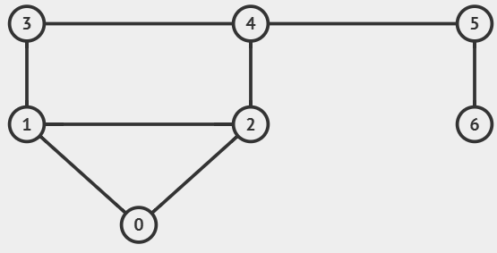
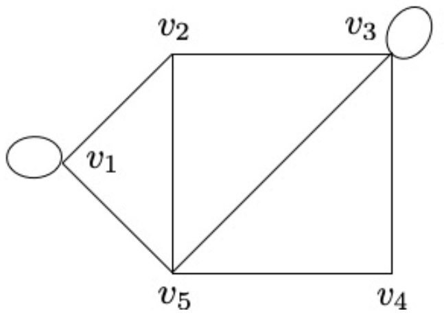
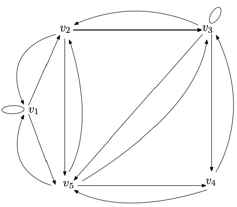

# Graph Theory Basics

<div class="columns">


</div>

> Please go to <https://github.com/MPT-ADVANCED-2024/Class-Material/tree/master/week9> to access the slides and code snippets.
> images source: <https://visualgo.net/en/graphds>

---

# Graph Definition

- A graph $G$ is a pair $(V, E)$ where:
  - $V$ is a set of vertices (nodes)
  - $E$ is a set of edges connecting pairs of vertices



---

# Undirected vs Directed

> An **undirected** edge $u \leftrightarrow v$ can be represented as two **directed edges** $u \rightarrow v$ and $v \rightarrow u$



---

# Weighted vs Unweighted

- Weights on edges can represent distances, costs, capacities, etc.
- Unweighted graphs can be considered as weighted graphs with all weights equal to $1$


---

# Connected vs Disconnected

<div class="columns">

- For **undirected** graphs
  - A graph is **connected** if there is a path between every pair of vertices
  - A c**onnected component** is a maximal connected **subgraph**


</div>

---

# Connected vs Disconnected

<div class="columns">

- For **directed** graphs
  - A graph is **strongly connected** if there is a directed path between every pair of vertices
  - A graph is **weakly connected** if its underlying undirected graph is connected

<div class="columns">


</div>

</div>

---

# Simple Graph vs Multigraph

<div class="columns">

<div>

- **Loop**: An edge connecting a vertex to itself
- **Multiple edges**: More than one edge between the same pair of vertices

</div>

- **Simple graph**: No loops or multiple edges
- **Multigraph**: May have loops or multiple edges

</div>

<div class="columns">

 

- Most Problems we encounter have simple graphs

</div>

---

# Special Types of Graphs

## Trees

<div class="columns">

- Connected graph with no cycles
- $|E| = |V| - 1$
- Exactly one path between any two vertices
- Once a **root** vertex is chosen, it forms a **rooted tree**, with **parent-child** relationships between vertices


</div>

---

# Special Types of Graphs

## 2D Grid Graphs

<div class="columns">

<div>

- Each cell connects to adjacent cells
- Usually 4 or 8 directions
- Cell $\leftrightarrow$ Vertex, Edge $\leftrightarrow$ Adjacency

```python
NEIGHBORS = [[0, 1], [1, 0], [0, -1], [-1, 0]]

i, j = current_cell
for di, dj in NEIGHBORS:
    ni, nj = i + di, j + dj
    if 0 <= ni < N and 0 <= nj < M:
        # Process edge (i, j) -> (ni, nj)
```

</div>

```
###############################
#...#...............#.......#.#
#.###.#####.#######.###.#.#.#.#
#...#.#...#.#..S..#...#.#.#.#.#
###.#.#.#.#.#####.###.#.#.#.#.#
#...#...#.#...#.#...#.#.#.#...#
#.#######.#.###.###.#.###.###.#
#.....#...#....E..#.#.....#...#
#.###.#.###########.#######.###
#...#...............#.........#
###############################
```

</div>

---

<!-- _footer: There are more types, but I am too lazy to list them all -->

# Special Types of Graphs

## Directed Acyclic Graphs (DAGs)

<div class="columns">

- Directed graph with no cycles
- Usually pair with **topological-sort** and **dynamic programming** on graphs


<div>

---

# Graph Representation

<div class="columns">


```
    Adjacency Matrix      Adjacency List
|\|0, 1, 2, 3, 4, 5, 6|
-----------------------
|0|0, 1, 1, 0, 0, 0, 0|  0: [1, 2]
|1|1, 0, 1, 1, 0, 0, 0|  1: [0, 2, 3]
|2|1, 1, 0, 0, 1, 0, 0|  2: [0, 1, 4]
|3|0, 1, 0, 0, 1, 0, 0|  3: [1, 4]
|4|0, 0, 1, 1, 0, 1, 0|  4: [2, 3, 5]
|5|0, 0, 0, 0, 1, 0, 1|  5: [4, 6]
|6|0, 0, 0, 0, 0, 1, 0|  6: [5]
```

</div>

```
Edge List
[(0,1),(0,2),(1,2),(1,3),(2,4),(3,4),(4,5),(5,6)]
```

---

# Graph Representation

<div class="columns">


```
Adjacency Matrix   Adjacency List
|\|0, 1, 2, 3, 4|
-----------------
|0|0, 2, 6, 7, 0|  0: [(1,2),(2,6),(3,7)]
|1|0, 0, 0, 3, 6|  1: [(3,3),(4,6)]
|2|0, 0, 0, 0, 1|  2: [(4,1)]
|3|0, 0, 0, 0, 5|  3: [(4,5)]
|4|0, 0, 0, 0, 0|  4: []
```

</div>

```
Edge List
[(0,1,2),(0,2,6),(0,3,7),(1,3,3),(1,4,6),(2,4,1),(3,4,5)]
```

---

<style scoped>section { font-size: 24px; }</style>

# Typical input format for graphs: Edge List

<div class="columns">

<div>

The first line of each test case contains two integers $n$, $m$ ($1 \le n \le 10^4$, $n - 1 \le m \le \min(\frac{n \cdot (n - 1)}{2}, 10^4)$) — the number of vertices and the number of edges in the graph, respectively.

Each of the next $m$ lines of each test case contains two integers $u_i$, $v_i$ ($1 \le u_i, v_i \le n$) — the edges of the graph. It is guaranteed that the graph is connected and there are no multiple edges or self-loops.

</div>

<div class="columns">

```
7 8
1 2
1 3
2 3
2 4
3 5
4 5
5 6
6 7
```


</div>

</div>

> From <https://codeforces.com/problemset/problem/1991/E>
> Note that the vertices are usually 1-indexed, instead of 0-indexed

---

<style scoped>section { font-size: 26px; }</style>

# Build Adjacency Matrix/List from Edge List

```python
N, M = map(int, input().split())
adj_matrix = [[0] * (N + 1) for _ in range(N + 1)]  # 1-indexed
for _ in range(M):
    u, v = map(int, input().split())
    adj_matrix[u][v] = 1
    adj_matrix[v][u] = 1  # only for undirected graph

for row in adj_matrix:
    print(row)
```

```python
N, M = map(int, input().split())
adj_list = [[] for _ in range(N + 1)]  # 1-indexed
for _ in range(M):
    u, v = map(int, input().split())
    adj_list[u].append(v)
    adj_list[v].append(u)  # only for undirected graph

for i, neighbors in enumerate(adj_list):
    print(i, neighbors)
```

---

<style scoped>section { font-size: 26px; }</style>

# Build Adjacency Matrix/List from Edge List

```python
N, M = map(int, input().split())
adj_matrix = [[0] * (N + 1) for _ in range(N + 1)]  # 1-indexed
for _ in range(M):
    u, v, w = map(int, input().split())  # w -> weight
    adj_matrix[u][v] = w
    adj_matrix[v][u] = w  # only for undirected graph

for row in adj_matrix:
    print(row)
```

```python
N, M = map(int, input().split())
adj_list = [[] for _ in range(N + 1)]  # 1-indexed
for _ in range(M):
    u, v, w = map(int, input().split())
    adj_list[u].append((v, w))
    adj_list[v].append((u, w))  # only for undirected graph

for i, neighbors in enumerate(adj_list):
    print(i, neighbors)
```

---

<style scoped>section { font-size: 28px; }</style>

# Graph Representations

- Edge List
  - rarely used, only useful for certain algorithms (e.g., Kruskal's Minimum Spanning Tree)
- Adjacency Matrix
  - Can only represent simple graphs
  - Slow for neighborhood queries in sparse graphs where $|E| \approx |V|$
  - $O(1)$ time to check if two vertices are connected and the weight of edge connecting them
- Adjacency List
  - Use dynamic arrays (`list` in python) or linked lists to store neighborhood information
  - Most common representation, suitable for most problems

---

<style scoped>section { font-size: 24px; }</style>

# Graph Traversal: Depth-First Search (DFS)

- Explores as far as possible along each branch
- Uses a stack (explicit or via recursion. Using recursion is easier, but the default recursion limit in python is 1000, you need to increase it manually)
- Time complexity: $O(V + E)$ when using adjacency list, $O(V^2)$ when using adjacency matrix

<div class="columns">

```python
import sys; sys.setrecursionlimit(1000000)
visited = [False] * (N + 1)
# recursion variant 1
def dfs(cur: int) -> None:
    if visited[cur]: return
    visited[cur] = True
    print(f"Visiting {cur}")
    for neighbour in adj_list[cur]:
        dfs(neighbour)
    print(f"Leaving {cur}")

dfs(start)
```

```python
import sys; sys.setrecursionlimit(1000000)
visited = [False] * (N + 1)
# recursion variant 2
def dfs(cur: int) -> None:
    print(f"Visiting {cur}")
    for neighbour in adj_list[cur]:
        if not visited[neighbour]:
            visited[neighbour] = True
            dfs(neighbour)
    print(f"Leaving {cur}")

visited[start] = True
dfs(start)
```
</div>

<https://visualgo.net/en/dfsbfs>

---

<div class="columns">

```python
import sys; sys.setrecursionlimit(1000000)
visited = [False] * (N + 1)

# recursion variant 2
def dfs(cur: int) -> None:
    print(f"Visiting {cur}")
    for neighbour in adj_list[cur]:
        if not visited[neighbour]:
            visited[neighbour] = True
            dfs(neighbour)
    print(f"Leaving {cur}")

visited[start] = True
dfs(start)
```

```python
visited = [False] * (N + 1)

# using stack explicitly
visited[start] = True
stack = [start]
while stack:
    cur = stack.pop()
    print(f"Visiting {cur}")
    for neighbour in adj_list[cur]:
        if not visited[neighbour]:
            visited[neighbour] = True
            stack.append(neighbour)
```

</div>

---

If the graph is a tree, you don't need to use a `visited` array, you can simply pass the parent node to the recursive function and avoid visiting the parent node again.


```python
def dfs(cur: int, parent: int = -1) -> None:
    print(f"Visiting {cur}")
    for neighbour in adj_list[cur]:
        if neighbour != parent:
            dfs(neighbour, cur)
    print(f"Leaving {cur}")
```

```python
parent = [-1] * (N + 1)
# get parent of each node
def dfs(cur: int) -> None:
    for neighbour in adj_list[cur]:
        if parent[cur] != neighbour:
            parent[neighbour] = cur
            dfs(neighbour)
```

---

# Graph Traversal: Breadth-First Search (BFS)

- Explores all neighbors before going deeper
- Uses a queue (use `deque` in python)
- Time complexity: Same as dfs

```python
from collections import deque

visited = [False] * (N + 1)
visited[start] = True
queue = deque([start])
while queue:
    cur = queue.popleft()
    print(f"Visiting {cur}")
    for neighbour in adj_list[cur]:
        if not visited[neighbour]:
            visited[neighbour] = True
            queue.append(neighbour)
```

---

# Flood Fill a 2D Grid

- uses BFS or DFS on a [2D grid](#2d-grid-graphs)

---

<style scoped>section { font-size: 26px; }</style>

# Single Source Shortest Path (SSSP)

- On Unweighted Graphs, simply use BFS is enough, since the shortest path is the path with the smallest number of edges

```python
from collections import deque

INF = int(1e18)

dist = [INF] * (N + 1)
dist[start] = 0
queue = deque([start])
while queue:
    cur = queue.popleft()
    for neighbour in adj_list[cur]:
        if dist[neighbour] == INF:
            dist[neighbour] = dist[cur] + 1
            queue.append(neighbour)
print(dist)
```

<https://visualgo.net/en/sssp>

---

<style scoped>section { font-size: 24px; }</style>

## Dijkstra's Algorithm

- Like BFS, but instead of getting the vertex with the smallest depth, we get the next vertex with the smallest distance from the source
- Works if there are no negative cycles in the graph, with $O(|E| \log |E|)$ time using binary heap

```python
from heapq import heappush, heappop  # implement priority queue with binary heap

INF = int(1e18)
dist = [INF] * (N + 1)
dist[start] = 0
pq = [(0, start)]  # priority queue, query the vertex with smallest distance within O(log|V|)
while pq:
    cur_dist, cur = heappop(pq)  # pop vertex with smallest distance
    if cur_dist > dist[cur]:  # if the distance is outdated, continue
        continue
    for neighbour, weight in adj_list[cur]:
        if (new_dist := dist[cur] + weight) < dist[neighbour]:
            dist[neighbour] = new_dist
            heappush(pq, (new_dist, neighbour))
print(dist)
```

<https://visualgo.net/en/sssp>

---

- Negative cycles can lead to infinite loops in Dijkstra's Algorithm


<https://visualgo.net/en/sssp>

---

# Bellman-Ford Algorithm

- Can report negative cycles or get shortest path with $O(|V||E|)$ time complexity

```python
from collections import deque

INF = int(1e18)

dist = [INF] * (N + 1)
in_queue = [False] * (N + 1)
depth = [0] * (N + 1)  # count of edges in the shortest path from start to i
dist[start] = 0
in_queue[start] = True
queue = deque([start])
```

---

```python
while queue:
    cur = queue.popleft()
    in_queue[cur] = False
    for neighbour, weight in adj_list[cur]:
        if (new_dist := dist[cur] + weight) < dist[neighbour]:
            dist[neighbour] = new_dist
            depth[neighbour] = depth[cur] + 1
            if depth[neighbour] >= N:
                """
                Without passing through a negative cycle, the shortest
                path should pass through at most n - 1 edges, so if it
                passes through more than n edges, it must have passed
                through a negative cycle.
                """
                print("Negative cycle detected")
                quit()
            if not in_queue[neighbour]:
                in_queue[neighbour] = True
                queue.append(neighbour)
print(dist)
```

---

- DFS/BFS
  - <https://cses.fi/problemset/task/1192>
  - <https://leetcode.com/problems/keys-and-rooms/>
  - <https://leetcode.com/problems/number-of-islands/>
  - <https://leetcode.com/problems/max-area-of-island/>
  - <https://leetcode.com/problems/pacific-atlantic-water-flow/>
- Dijkstra
  - <https://leetcode.com/problems/network-delay-time/>
  - <https://www.spoj.com/problems/EZDIJKST/en/>
  - <https://open.kattis.com/problems/shortestpath1>
- Bellman-Ford
  - <https://open.kattis.com/problems/shortestpath3>